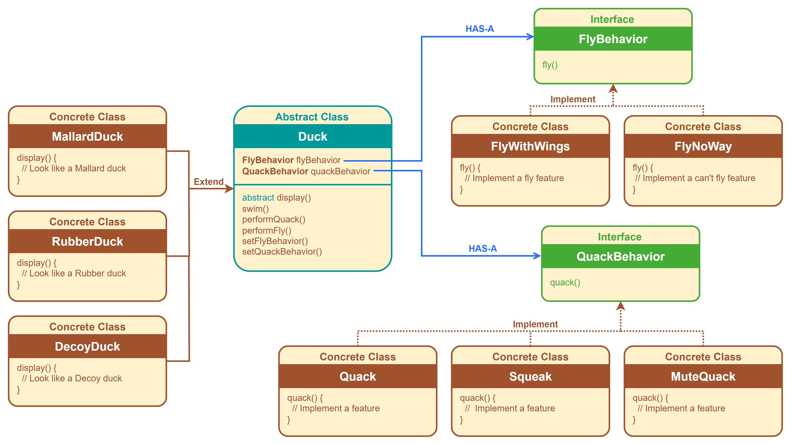

# Design Patterns

This repository includes practice code in **Java** and **Python(Feature)**.

## How to Use

1. Open a terminal and `cd` into the folder containing `run.bat`.
2. Run the following command: `run.bat`

## Table of Contents

1. **Strategy Pattern**
    
    - **Java**
        - withoutpattern
        - Duck(basic)
        - Game
2. **Observer Pattern**
    - **Java**
        - Weather